# TinyThreads Visual Diagrams and Flow Charts

This document contains Mermaid diagrams that can be rendered in GitHub, GitLab, or using tools like [Mermaid Live Editor](https://mermaid.live).

---

## 1. System Architecture Overview

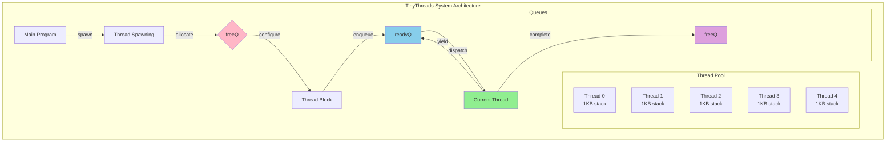

---

## 2. Thread State Machine

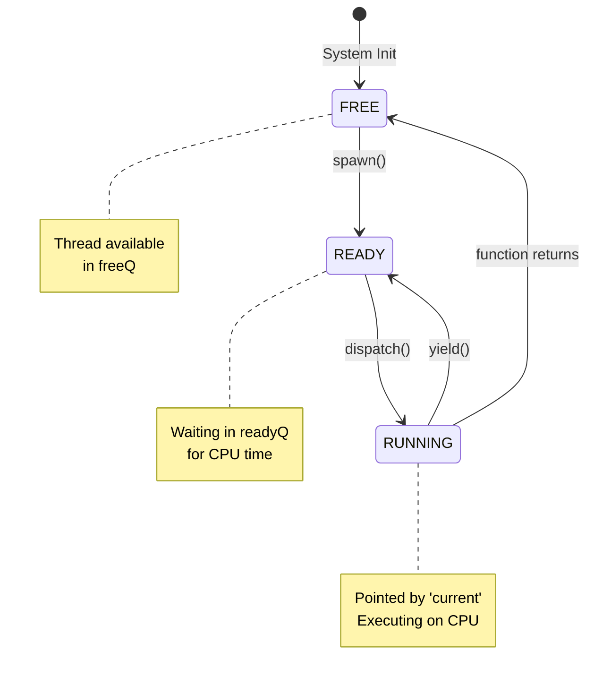

---

## 3. Context Switch Sequence

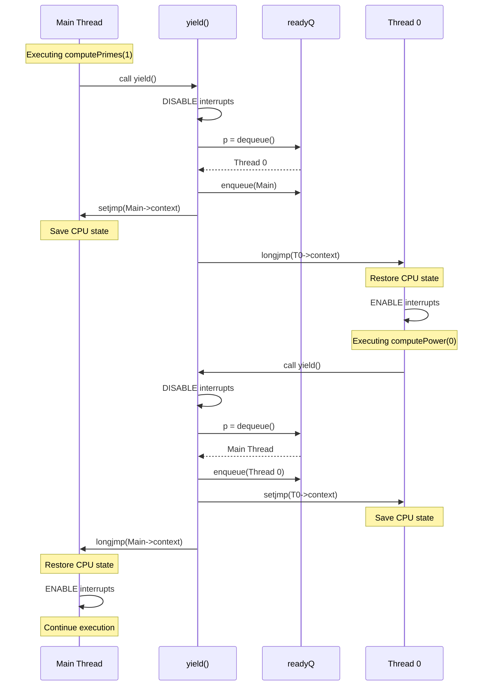

---

## 4. spawn() Function Flowchart

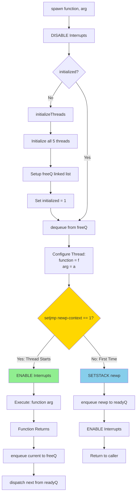

---

## 5. yield() Function Flowchart

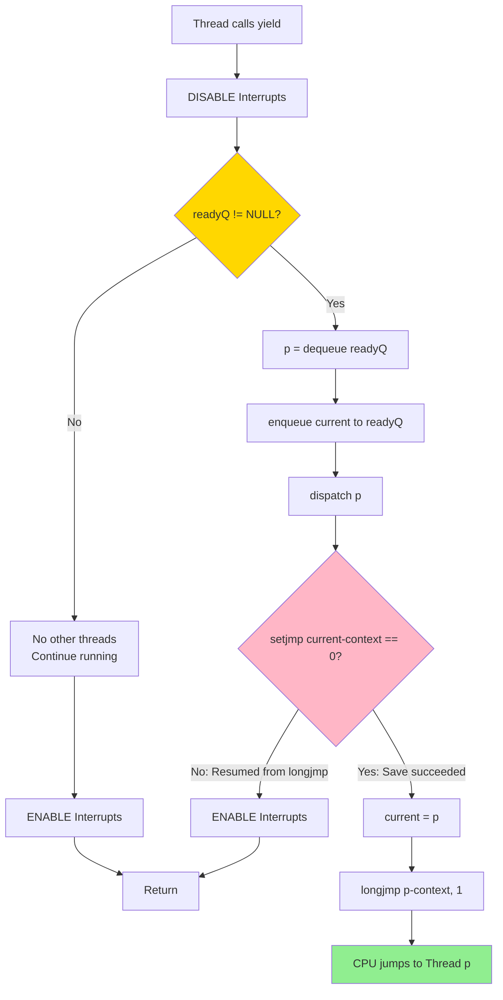

---

## 6. Queue Operations

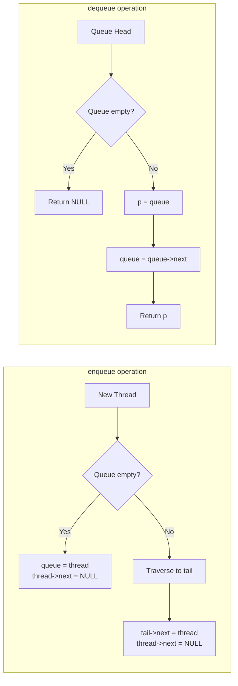

---

## 7. Memory Layout

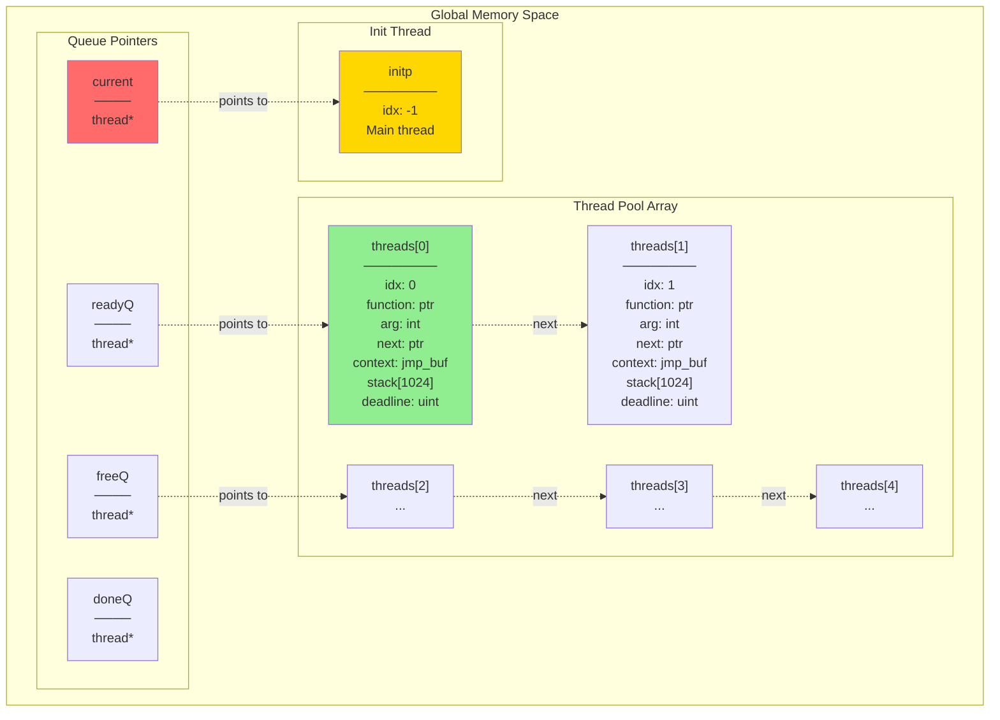

---

## 8. Program Execution Timeline

```mermaid
gantt
    title TinyThreads Execution Timeline
    dateFormat X
    axisFormat %L ms
    
    section Main Thread
    Init System           :0, 100
    spawn(computePower)   :100, 50
    computePrimes starts  :150, 200
    Prime 2 found         :350, 500
    yield()              :850, 100
    Wait for turn        :950, 500
    Prime 3 found        :1450, 500
    yield()             :1950, 100
    
    section Thread 0
    Created              :100, 50
    Wait in readyQ       :150, 700
    0^2=0 computed       :850, 500
    yield()             :1350, 100
    Wait in readyQ      :1450, 500
    1^2=1 computed      :1950, 500
    
    section Context
    Main → T0 switch     :850, 100
    T0 → Main switch    :1350, 100
    Main → T0 switch    :1950, 100
```

---

## 9. Concurrency Model

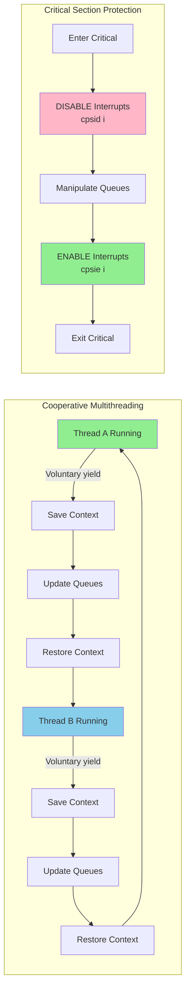

---

## 10. Initialization Sequence

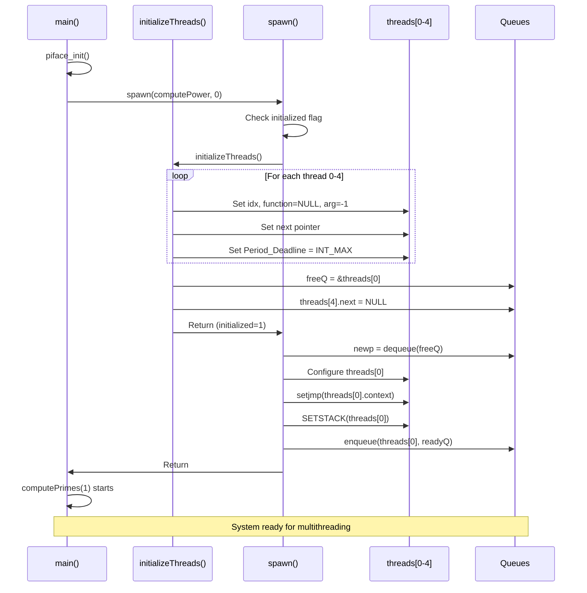

---

## 11. Data Structure Relationships

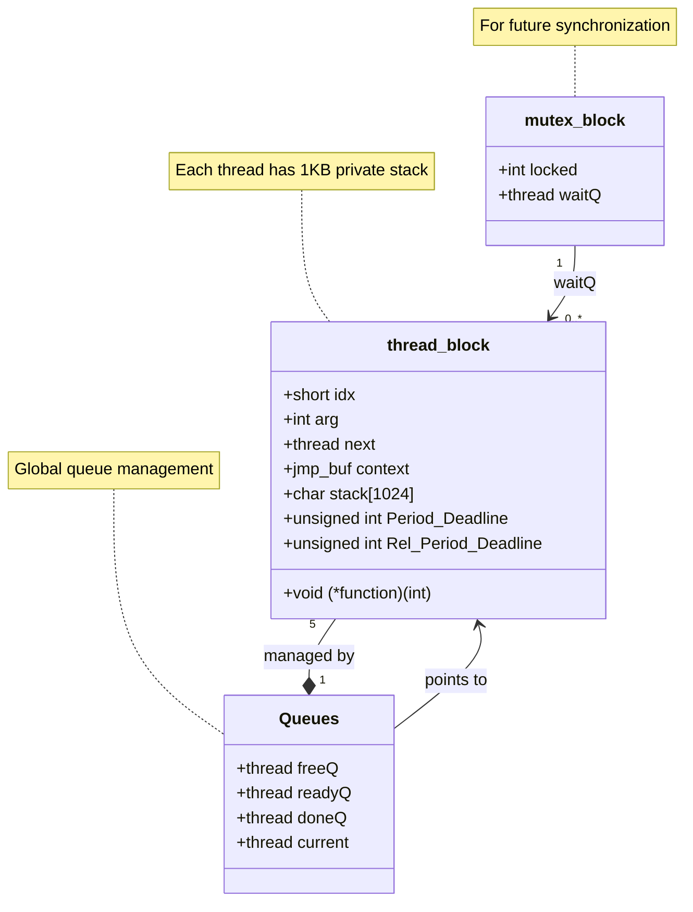

---

## 12. Round-Robin Scheduling

```mermaid
graph TB
    subgraph "Round-Robin Cycle"
        A[Main: Prime 2] -->|yield| B[Context Switch]
        B --> C[Thread 0: 0^2=0]
        C -->|yield| D[Context Switch]
        D --> E[Main: Prime 3]
        E -->|yield| F[Context Switch]
        F --> G[Thread 0: 1^2=1]
        G -->|yield| H[Context Switch]
        H --> I[Main: Prime 5]
        I -->|yield| J[Context Switch]
        J --> K[Thread 0: 2^2=4]
        K -->|yield| L[Context Switch]
        L --> A
    end
    
    style A fill:#FFD700
    style C fill:#87CEEB
    style E fill:#FFD700
    style G fill:#87CEEB
    style I fill:#FFD700
    style K fill:#87CEEB
```

---

## 13. Critical Section Timing

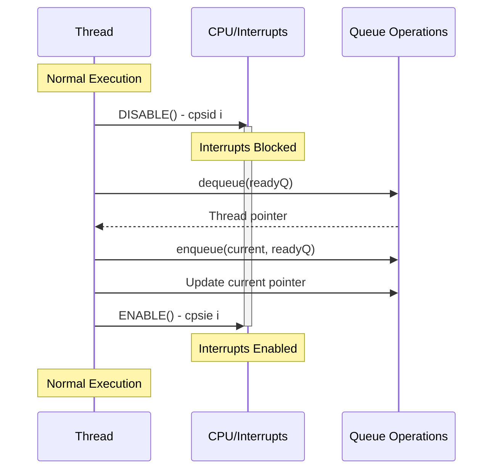

---

## 14. Assignment 3 Part 1 Specific Flow

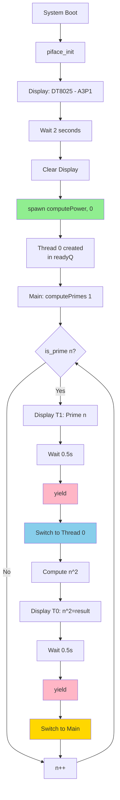

---

## 15. Complete System Interaction

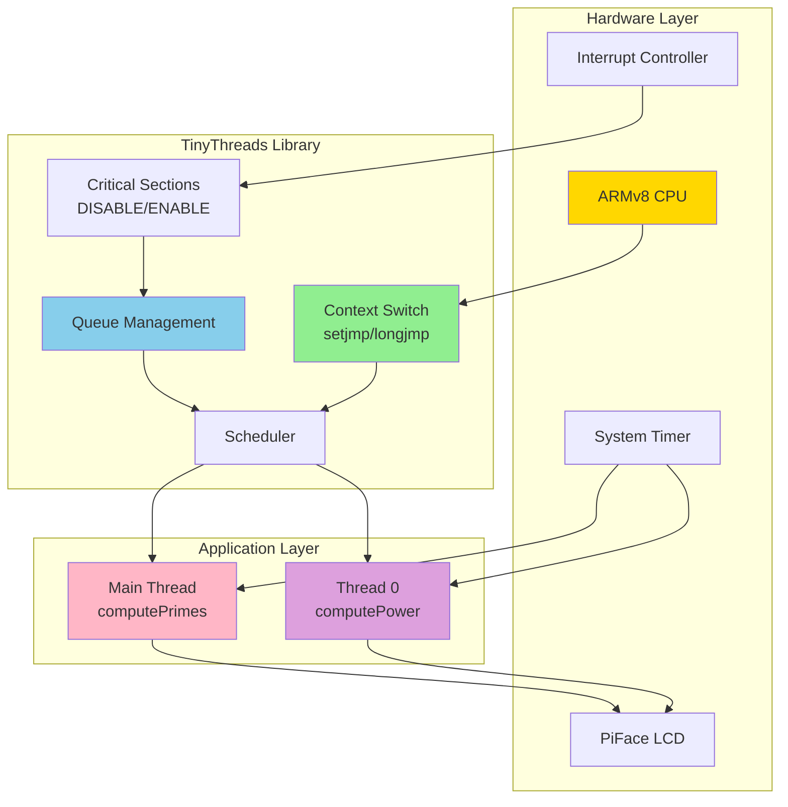

---

## How to Use These Diagrams

### Online Rendering
1. Copy any diagram code block (including the \`\`\`mermaid markers)
2. Paste into [Mermaid Live Editor](https://mermaid.live)
3. The diagram will render interactively

### In Markdown Viewers
- **GitHub**: Automatically renders Mermaid diagrams
- **GitLab**: Automatically renders Mermaid diagrams
- **VS Code**: Install "Markdown Preview Mermaid Support" extension
- **Obsidian**: Built-in Mermaid support

### Export Options
- PNG/SVG: Use Mermaid Live Editor's export function
- PDF: Print from browser after rendering
- Presentations: Use Marp or reveal.js with Mermaid plugin

---

## Legend

- 🟢 **Green**: Active/Running state
- 🔵 **Blue**: Ready/Waiting state
- 🔴 **Red**: Critical section/Protected
- 🟡 **Yellow**: Decision point/Main thread
- 🟣 **Purple**: Completed/Done

---

**Note**: These diagrams are designed to be progressive learning tools. Start with the simple architecture overview and progress to the detailed sequence diagrams to build a complete mental model of TinyThreads operation.

